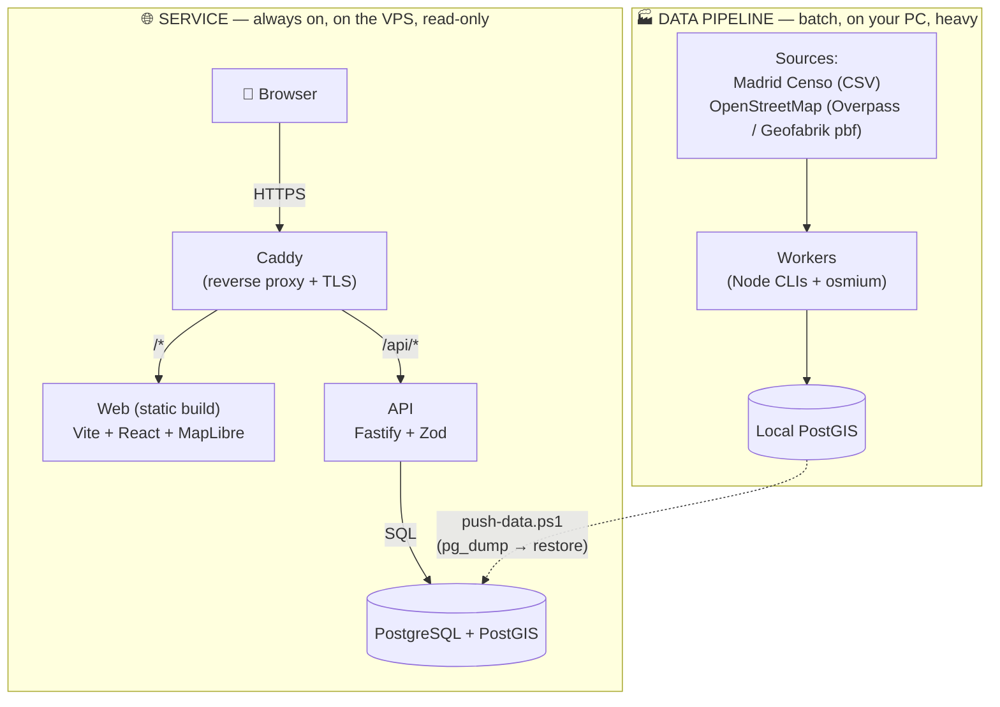
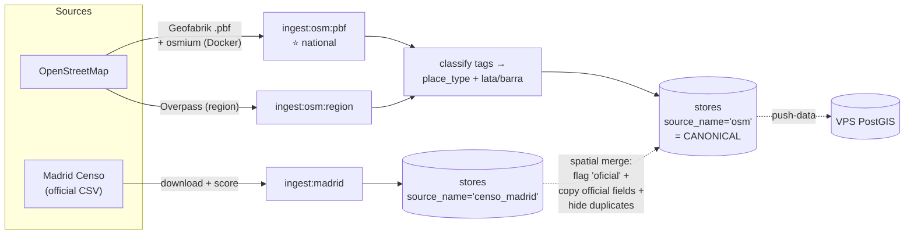
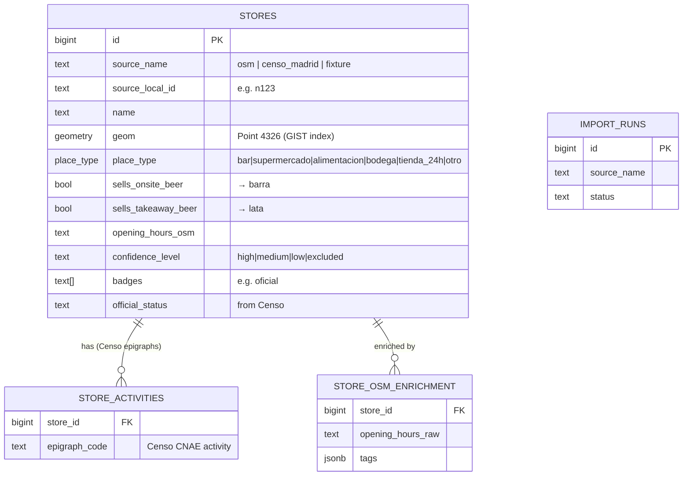
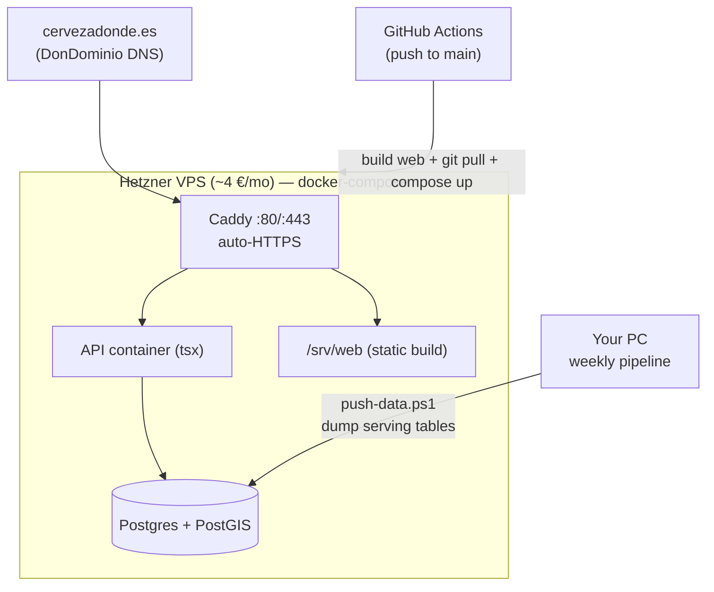

# 00 — Architecture overview

How cervezadonde.es fits together, end to end. Start here.

> One-liner: a mobile-first map that answers **"¿dónde está la cerveza abierta
> más cercana ahora?"** — distinguishing **barra** (para tomar) from **lata**
> (para llevar), honouring opening hours and Madrid's 22:00–09:00 ordinance.

## 1. The one idea: two separate worlds

The whole system splits into two flows with opposite needs. Internalise this
and everything else falls into place.



- **Service**: always online, only *reads*, answers fast. Lives on a small VPS.
- **Pipeline**: *builds* the data, is slow/heavy, runs on the maintainer's PC on
  demand, then **publishes** the finished tables to the VPS. The expensive work
  (downloading, filtering, matching hundreds of thousands of places) never
  touches production.

Everything is one **pnpm monorepo**.

## 2. Request flow (what happens when you open the map)

```mermaid
sequenceDiagram
  participant B as Browser (React)
  participant C as Caddy
  participant A as API (Fastify)
  participant P as PostGIS

  B->>C: GET /api/stores/map?bbox=…&open_now=…
  C->>A: proxy → /stores/map (strips /api)
  A->>P: spatial query (ST_MakeEnvelope, GIST index)
  P-->>A: rows in the viewport
  A->>A: openNow.ts — for each row, compute<br/>"can it sell/serve a beer now?"<br/>(Europe/Madrid time + 22:00 ordinance)
  A-->>B: { now, ordinance, results[] }
  B->>B: colour markers by intent (lata/barra),<br/>ring by open state; draw legend + time chip
```

Same-origin routing (`/api/*` → API, everything else → static web) means **no
CORS** and one TLS cert. The web is built with `VITE_API_URL=/api`.

## 3. Data pipeline flow (how stores get built)



**Model (ADR-007):** OSM is the **canonical** source of *what places exist*
nationwide (one uniform schema). The Madrid Censo is **enrichment**: where it
matches an OSM store it stamps `oficial` and merges its official address /
district / status; the duplicate Censo row is hidden (not deleted); Censo-only
places stay active. No official data is lost.

## 4. Components

### Web — `apps/web`
Vite + React 18 + **MapLibre GL JS** (open map renderer) + TypeScript.
- `App.tsx` — the map, viewport fetching, markers, geolocation, nearest-open card.
- `store-view.ts` — derives **intent** (barra/lata) and **state** (open /
  ordinance / closed / unconfirmed) → marker colour + ring.
- `Controls.tsx` — time chip, filter chips. `StoreCard.tsx` — the detail sheet.
- In production it's **static files** served by Caddy (no server).

### API — `apps/api`
Node 22 + **Fastify** + **Zod** + the `postgres` client, run under **tsx**.
- Routes: `/health`, `/stores/nearby` (lat/lng + radius), `/stores/map` (bbox).
  Filters: `open_now`, `intent`, `hide_chains`, `place_type`, `at_time`.
- **`openNow.ts`** — the product's core logic (see §6).

### Database — `packages/db` + PostgreSQL/PostGIS
- **PostGIS** does the geospatial work; a functional GIST index on
  `(geom::geography)` makes "nearby" and the OSM↔Censo match fast.
- `packages/db` holds the **migrations** (`node-pg-migrate`, `migrations/*.sql`)
  and the shared connection client.

### Shared contract — `packages/shared`
**Zod** schemas shared by web + API: the shape of a `store`, each endpoint's
query/response. One source of truth; a change is type-checked on both sides.

### Workers — `apps/worker`
Node + TypeScript CLIs (`commander`). Each is a batch job:

| Command | Role |
|---|---|
| `ingest:madrid` | Download the Madrid Censo CSV, score it, upsert (enrichment source). |
| `ingest:osm` | Add OSM `opening_hours` onto existing stores (legacy enrichment). |
| `ingest:osm:region` | Overpass → canonical stores for a region (prototype). |
| **`ingest:osm:pbf`** | **Geofabrik `.pbf` + osmium → canonical stores, national.** |
| `diagnose:madrid` | Inspect the Censo file shape, no writes. |

The national path (`ingest:osm:pbf`): download a Geofabrik extract →
**osmium** (`tags-filter` + `export`, run in a Docker image) filters bars+shops
→ stream the GeoJSON, take a point per place (centroid for ways) → classify →
`persistOsmCanonical` (bulk upsert + the Censo merge).

## 5. Data model



All sources live in the **same `stores` table**, tagged by `source_name`. The
map shows rows where `confidence_level <> 'excluded'`. The displayed row is
computed from the layers (OSM canonical + Censo merged on top), never a single
flat truth. Provenance stays separable (ODbL/attribution clarity).

## 6. The "open now" logic (product core)

`apps/api/src/openNow.ts` is pure, testable, and the only place these rules
live:

```mermaid
flowchart TD
  START["place + current time (Europe/Madrid)"] --> HRS{opening_hours known?}
  HRS -- no --> UNC["'Horario no confirmado'<br/>(blue)"]
  HRS -- yes --> OPEN{open at this time?}
  OPEN -- no --> CLO["'Cerrado' (grey)"]
  OPEN -- yes --> BAR{is it a bar?<br/>(consumes on-site)}
  BAR -- yes --> SELL["✅ can serve a beer now<br/>(green)"]
  BAR -- no --> TA{sells takeaway beer?}
  TA -- no --> NO["doesn't sell beer"]
  TA -- yes --> ORD{22:00–09:00<br/>ordinance window?}
  ORD -- yes --> AMB["⛔ open but can't sell now<br/>(amber, ordinance)"]
  ORD -- no --> SELL2["✅ can sell a beer now<br/>(green)"]
```

The 23:30 shop line — *"no puede venderte cerveza ahora (ordenanza)"* — is the
moment the product earns its keep; it's invisible on a generic map.

## 7. Infrastructure & delivery



- **Code** deploys automatically on push to `main` (GitHub Actions over SSH).
- **Data** is published from your PC with `.\scripts\push-data.ps1` (dump the
  serving tables → restore on the VPS). See ADR-006 and `docs/13-deploy.md`.

## 8. Tech stack

| Layer | Tech |
|---|---|
| Web | Vite · React 18 · MapLibre GL JS · TypeScript |
| API | Node 22 · Fastify · Zod · postgres-js · (tsx in prod) |
| Workers | Node 22 · commander · csv-parse · osmium (Docker) |
| DB | PostgreSQL 16 · PostGIS 3.4 |
| Contract | Zod (shared types) |
| Proxy/TLS | Caddy |
| Monorepo | pnpm workspaces |
| Quality | Biome (lint/format) · Vitest (tests) · tsc |
| Infra | Docker Compose · Hetzner VPS · GitHub Actions |

## 9. Repo layout

```
apps/
  web/       Vite + React + MapLibre map UI
  api/       Fastify HTTP API + open-now evaluator
  worker/    ingestion CLIs (Censo, OSM Overpass, OSM Geofabrik/osmium)
packages/
  shared/    Zod contract (types shared by web + API)
  db/        PostGIS migrations + connection client
deploy/      production stack (Dockerfile.api, compose, Caddyfile, restore)
docker/      osmium.Dockerfile (OSM pbf toolchain)
scripts/     push-data.ps1 (publish data PC → VPS) + helpers
docs/        this overview + product/architecture/data/deploy docs
decisions/   ADRs 001–007
```

See the [ADRs](../decisions/) for the *why* behind the big choices — especially
[ADR-004](../decisions/ADR-004-madrid-alcohol-ordinance.md) (ordinance),
[ADR-005](../decisions/ADR-005-osm-opening-hours.md) (OSM hours),
[ADR-006](../decisions/ADR-006-deployment.md) (deployment) and
[ADR-007](../decisions/ADR-007-national-osm-primary.md) (OSM-canonical national).
