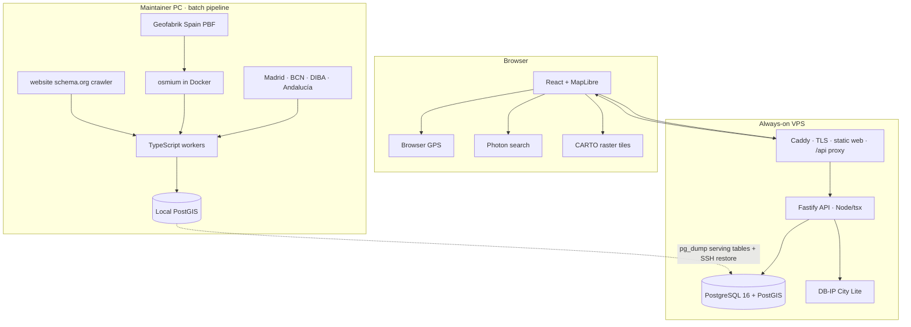
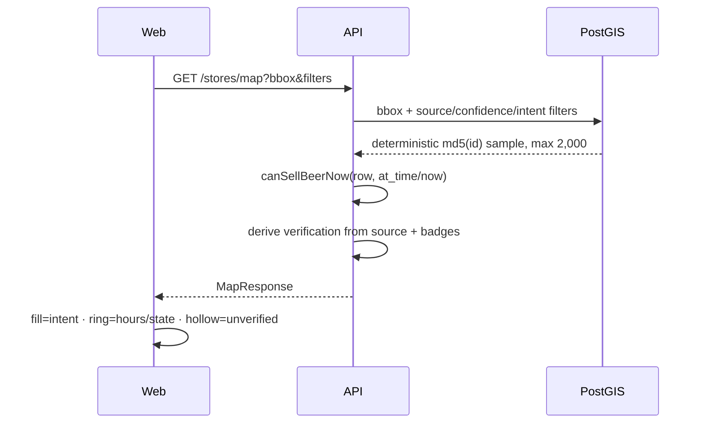
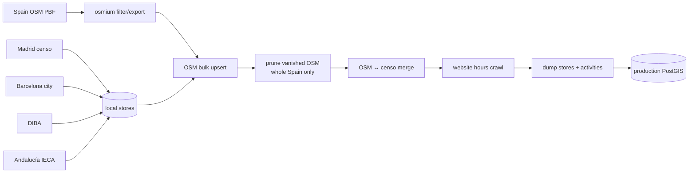
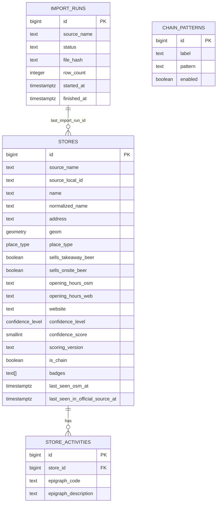

# 17 · Project atlas

Status: current-system map, audited 2026-07-26 against the working tree, the
local PostGIS database, and the public read-only endpoints.

Update 2026-07-29: the censo-only serving and proximity-match portions of this
snapshot are superseded by
[`19-data-reliability-refinement.md`](./19-data-reliability-refinement.md) and
ADR-008. The atlas remains the system orientation for unaffected areas.

This document describes what cervezadonde.es **is now**. It does not turn every
open question into a commitment. Historical intent remains in the earlier docs;
their authority map lives in [`docs/README.md`](./README.md).

## 1. Product compass

cervezadonde.es is a live, mobile-first map for one job:

> Find a nearby place where I can get a beer, with enough honesty about
> existence and opening hours that I can decide whether to walk there.

The product vocabulary has two intents:

- **barra** — consume on-site: bars, pubs, cafés, restaurants and fast food;
- **lata** — take away: supermarkets, food shops, bodegas, 24-hour shops and
  selected fuel stations.

The useful answer is not a generic POI result. It is the intersection of four
questions:

1. does this record correspond to a place that still exists?
2. is it correctly classified as a beer source?
3. is it open at the requested time?
4. may it sell or serve beer under the applicable local rules?

The code models the middle two fairly well, has an interim model for the first,
and currently models the fourth as if all of Spain followed Madrid's rule. That
last point is a known truthfulness boundary, not an invisible implementation
detail.

### Non-goals that remain useful boundaries

- no Google Maps/Places scraping or bulk data extraction;
- no generic reviews/social network;
- no owner ethnicity/origin categories;
- no microservice or streaming architecture;
- no claim that estimated hours are confirmed;
- no claim that an administrative licence alone proves a business is still
  trading.

Google Maps is currently used only as a user-facing directions URL. Map tiles
come from CARTO/OSM and text search comes from Photon.

## 2. Reality snapshot

Observed from the local database on 2026-07-26. The public
`GET /api/meta` returned the same serving counts and a data timestamp of
`2026-07-19T13:02:53.818Z`, so local and production serving snapshots aligned
at audit time.

| Measure | Value |
|---|---:|
| Physical `stores` rows | 230,320 |
| Active rows (`confidence_level <> 'excluded'`) | 207,304 |
| Excluded rows | 23,016 |
| Active rows with real OSM or website hours | 29,586 (14.3%) |
| `verified` API label (OSM + `oficial` badge) | 29,801 (14.4%) |
| `mapped` (OSM only) | 139,900 (67.5%) |
| `unverified` (censo/fixture only) | 37,603 (18.1%) |
| Active rows with an empty display name | 14,043 |
| Active rows without an address | 94,408 |
| Database size | 349 MB |
| Tests | 180 passing |

Active contribution by source:

| Source | Active rows | Role |
|---|---:|---|
| `osm` | 169,701 | National POI backbone and primary real-hours source |
| `censo_andalucia` | 18,579 | Unmatched official-directory additions |
| `censo_madrid` | 7,812 | Unmatched official-censo additions |
| `censo_barcelona` | 6,195 | Unmatched Barcelona-city additions |
| `censo_diba` | 4,990 | Unmatched Barcelona-province additions |
| `madrid_sample_fixture` | 27 | Local-development fixture; also present in the serving snapshot |

“Active contribution” does not mean every row is a real current business.
Censo-only rows are deliberately visible but hollow/labelled because licence
registers lag closures.

## 3. The system in one picture

There are two deliberately separate workloads:

- the **service** is small, read-mostly and always on;
- the **pipeline** is heavy, network- and disk-intensive, and runs locally.

That split is ADR-006 and is central to the cost model.

## 4. Repository map

| Path | Owns | Important entry points |
|---|---|---|
| `apps/web` | Browser UI, map, search, GPS, filters | `App.tsx`, `api.ts`, `store-view.ts` |
| `apps/api` | HTTP routes, spatial reads, time verdicts, trust ranking | `routes/stores.ts`, `openNow.ts`, `ranking.ts` |
| `apps/worker` | Downloads, classification, ingestion, merge, hours crawl | `cli.ts`, `ingest-osm-canonical.ts`, source adapters |
| `packages/shared` | Zod HTTP contract and shared types | `src/api.ts`, `src/store.ts` |
| `packages/db` | Connection client and schema history | `migrations/*.sql` |
| `deploy` | VPS containers, Caddy, restore | compose, Dockerfile, Caddyfile |
| `scripts` | Weekly orchestration, publishing, analytics | `refresh-all.ps1`, `push-data.ps1` |
| `decisions` | Architectural history and rationale | ADR-001…007 |
| `docs` | Product, operations, research and this atlas | `README.md` authority map |

The monorepo has six workspaces: web, API, worker, database, shared contract,
plus the private root package. Node 22 is used in CI/production; package engines
permit Node 20.10+.

## 5. Browser request flow

### Initial load

1. The web calls `GET /api/geo`.
2. The API performs a local DB-IP lookup and accepts only a broad Spain
   bounding box.
3. A result mounts the map at zoom 12 around the inferred city.
4. A failure or 1.2 s timeout fits the peninsula + Balearic Islands.
   Canarias is excluded from this fallback framing to avoid zooming over the
   Atlantic; a Canary visitor relies on IP geolocation or search/GPS.
5. CARTO raster tiles render a muted basemap.

At zoom `<= 11`, the web asks for server-side grid clusters. At zoom `> 11`, it
asks for up to 2,000 individual stores in the viewport.

### Zoomed-in map

The map query is not distance-ordered. If more rows exist than the limit, a
stable `md5(id)` ordering attempts a spatially neutral-looking sample. It does
not guarantee geographic uniformity mathematically.

### “Cerca de mí” and the flagship answer

1. GPS is requested only after the user presses the button.
2. The map flies to zoom 15 and stores the GPS coordinate in browser state.
3. The web requests `nearby`, radius 3 km, `limit=1`, `open_now=true`.
4. The API fetches at most the 200 nearest raw candidates, computes time
   verdicts in JavaScript, removes candidates that cannot sell/serve now, then
   ranks:
   - OSM-backed (`verified`/`mapped`) first;
   - censo-only (`unverified`) second;
   - distance within each tier.
5. The selected result gets a card and an extra map ring.

Moving or searching the map does **not** move the stored GPS origin. Therefore
the empty-state copy “prueba a mover el mapa” is currently inaccurate for this
card. There is also no guarantee that an open place beyond the first 200 raw
candidates will be found.

### Browser-side third parties

| Call | Data exposed |
|---|---|
| CARTO tiles | IP, requested tile coordinates, browser headers |
| Photon search | Typed search string, current map-centre bias, IP |
| Google directions link | Destination coordinate when the user clicks it |
| cervezadonde API | Viewport/GPS coordinates and request metadata; Caddy logs them |

The API-side IP city lookup is local and does not send the IP to another
service. “GPS stays in the browser” is only partly descriptive: the coordinate
is sent to our own `/nearby` API and appears in access logs.

## 6. Data build flow

The intended full-build order is:

Order matters because every censo ingest reactivates and rescoring its own
rows. The later OSM merge hides matched censo duplicates again.

### Sources and adapters

| Source | Ingest | Classification | Freshness behavior |
|---|---|---|---|
| Geofabrik Spain PBF | `ingest:osm:pbf -r spain` | Direct OSM tag mapping | Cached until `--fresh`; weekly script does use fresh by default |
| Madrid Censo Actividades | `ingest:madrid` | epigraphs + name hints via `v2-beer` | Cache reused unless `--fresh` |
| Barcelona ground-floor census 2024 | `ingest:barcelona` | finite activity-code lookup | Edition-pinned cache reused unless `--fresh` |
| DIBA GIA | `ingest:diba` | conservative Catalan free-text keywords | Cache reused unless `--fresh` |
| IECA establishments 2024 | `ingest:andalucia` | CNAE lookup from filtered WFS | Edition-pinned cache reused unless `--fresh` |
| Business websites from OSM | `crawl:hours` | schema.org JSON-LD → OSM syntax | Rechecked after 90 days |

### The cache/cadence discrepancy

`downloadIfNeeded` treats the presence of a cache file as a permanent cache hit.
The weekly `refresh-all.ps1` passes `--fresh` to OSM but not to any censo
command. Therefore a successful weekly run currently:

- rebuilds censo-derived rows from the same local files;
- downloads a new Spain PBF unless `-NoFreshPbf` is used;
- does **not** automatically obtain new censo editions/rows.

The local Madrid cache was dated 2026-06-02 while its latest import run was
2026-07-13, empirical confirmation of the behavior. This is a documentation and
pipeline-semantics gap, not merely an old comment.

### OSM extraction

`osmium tags-filter` keeps:

- `amenity=bar|pub|cafe|restaurant|fast_food|fuel`;
- `shop=convenience|alcohol|supermarket|general|kiosk`.

The GeoJSON parser then discards irrelevant dependency objects. Fuel stations
are retained when they have a recognized shop tag or, as a staffed-retail
proxy, hours and no automated/self-service marker.

Ways/polygons become a point by averaging all geometry coordinates. That is a
representative point, not a robust GIS centroid: it can be biased by duplicated
ring endpoints and may fall outside concave geometries.

### OSM stale pruning

Only a full `spain` run may hide OSM rows not seen in the latest import. A
safety valve skips pruning when more than 15% of active OSM rows appear to have
vanished or when nothing was seen. This protects the map from a broken extract,
at the cost of retaining stale rows when a legitimate or schema-driven change
crosses that threshold.

### OSM↔censo merge as implemented

For every active OSM row, the merge chooses the nearest censo row within 30 m:

- no name threshold;
- no place-type compatibility requirement;
- no one-to-one constraint;
- excluded censo rows participate to make reruns deterministic.

It then:

- copies censo address/district/neighbourhood/status onto the OSM row;
- appends the `oficial` badge;
- excludes the chosen censo row.

This is fast and deterministic, but it is a proximity merge, not entity
resolution. Multiple OSM rows can consume the same censo record, and multiple
censo records in a building may remain active. The empirical impact is in the
data-quality atlas.

## 7. Persistence model

The current schema after migration `1700000000010` is much simpler than some
older diagrams:

`store_osm_enrichment` was dropped by migration `0009`. Feedback,
store-overrides and moderation tables described in older docs do not exist.

All source rows share the `stores` table. “Computed display row from untouched
layers” is no longer an exact description: the merge mutates selected OSM rows
with censo fields and uses a badge to indicate the enrichment.

### Indexes

- GIST on `geom`;
- functional GIST on `(geom::geography)` for radius/distance;
- btree indexes on confidence and place type;
- partial indexes for the two beer-intent booleans;
- supporting indexes on activities and chains.

## 8. Four truth dimensions

Do not compress these into one confidence score:

| Dimension | Current representation | What it actually tells us |
|---|---|---|
| Existence | API `verification` | Which source family backs the displayed row |
| Classification | `confidence_level`, `confidence_score`, `scoring_version` | Confidence in type/usefulness; also overloaded with hidden/excluded state |
| Hours | `open_now.hours_source` | OSM, website, estimated default, or none |
| Freshness | last-seen fields + import/file timestamps | When a pipeline observed or reprocessed the record/source |

`verification='verified'` is the public/internal enum name, but today it means
“OSM row carrying an `oficial` badge produced by the 30 m merge.” It should not
be read as independently proven identity.

The fuller model and audit are in
[`18-data-quality-atlas.md`](./18-data-quality-atlas.md).

## 9. Open-now engine

`apps/api/src/openNow.ts` is pure and well tested. For each place:

1. choose hours in this order:
   - `opening_hours_osm`;
   - `opening_hours_web`;
   - default schedule by `place_type`;
   - no schedule for `otro`;
2. parse using the OSM `opening_hours` library;
3. if closed, return closed;
4. if a bar, allow on-site service;
5. otherwise require `sells_takeaway_beer`;
6. apply the 22:00–09:00 takeaway prohibition.

Default schedules are explicit guesses:

| Type | Default |
|---|---|
| bar | Mon–Thu 09:00–01:00; Fri–Sat to 02:00; Sunday 10:00–24:00 |
| supermarket | Mon–Sat 09:00–21:30; Sunday 10:00–15:00 |
| food shop | daily 10:00–22:00 |
| bodega | Mon–Sat split 10:00–14:00, 17:00–20:30 |
| 24h shop | 24/7 |
| fuel station | daily 06:00–24:00 |

Estimated-open results set `sells_beer_now=true` and participate in the
“nearest open” answer, while the UI labels the hours as estimated.

### Geographic limitation

The engine uses:

- `Europe/Madrid` for all rows;
- a Madrid coordinate and Spain country context for holiday/sun selectors;
- Madrid's 22:00–09:00 prohibition for every non-bar in every location.

The database has no municipality/autonomous-community policy key and the API
does not inspect coordinates before applying the rule. This causes demonstrably
wrong national behavior, including Canary time. It is the sharpest mismatch
between the Spain-wide product claim and the current domain model.

## 10. HTTP API as implemented

All production paths are prefixed `/api` by Caddy, which strips the prefix
before Fastify.

| Endpoint | Purpose | DB |
|---|---|---|
| `GET /health` | Process liveness | no |
| `GET /health/db` | PostGIS connectivity/version | yes |
| `GET /meta` | data timestamp and serving counts | yes |
| `GET /geo` | local-IP approximate city | local MMDB |
| `GET /stores/nearby` | radius + distance query, optional open filtering | yes |
| `GET /stores/map` | bbox individual points | yes |
| `GET /stores/clusters` | bbox grid counts | yes |

There is no store-detail endpoint, feedback endpoint or admin API yet.

### `nearby`

Important schema defaults:

- radius 1,000 m, max 5,000;
- limit 50, max 200;
- `open_now=false`;
- no default `min_confidence`;
- chains visible by default;
- `place_type` supports `gasolinera`;
- `at_time` is any JavaScript-parseable timestamp.

When `open_now=false`, results are pure distance order. When true, the API
overfetches up to at least 200 rows, filters on `sells_beer_now`, and applies
trust-tier order.

### `map`

- default limit 500, max 2,000; the web explicitly asks for 2,000;
- same relevant filters as nearby;
- open filtering happens after the SQL limit, so the result can be sparse even
  when additional open rows exist beyond the sample.

### `clusters`

- real counts grouped in degree-sized cells;
- supports type, intent, chain and confidence filters;
- cannot apply `open_now`, so “Abre ahora” at wide zoom still shows counts for
  all matching places.

### Contract caveats

- `min_confidence` is implemented as **equality**, not a minimum threshold.
- Query booleans use `z.coerce.boolean()`. In JavaScript, a non-empty string
  such as `"false"` coerces to true. The web avoids this by omitting false
  values, but the public API behavior is surprising.
- responses are TypeScript-typed but route outputs are not runtime-parsed
  through the response Zod schemas.
- there is no pagination or response cache, intentionally.

## 11. Web application

### Implemented controls

- segmented intent: Todo / Tomar / Llevar;
- “Abre ahora” toggle;
- hide-chain switch in the More sheet;
- GPS “Cerca de mí”;
- street/place search;
- time/ordinance chip once a point response has supplied `now`;
- dataset date and source summary;
- store card and Google directions link.

There are no UI controls for individual `place_type`, confidence tier, 24h,
verification-only, or feedback, despite their appearance in older designs.

### Marker language

- fill hue: intent (`barra` amber, `lata` blue);
- ring/state: confirmed open, estimated open, ordinance-blocked, unconfirmed,
  or closed;
- shape: censo-only rows are hollow;
- clusters: gold count bubbles.

The current working tree contains an uncommitted refinement that keeps
unverified markers hollow even when closed and expresses closure through
opacity. This atlas preserves that user work and describes it as working-tree
reality, not as a committed release.

### Concurrency behavior

Viewport requests are neither aborted nor sequence-numbered. A slow response
from an older pan/filter state can arrive after a newer one and overwrite the
map. Loading state has the same race. Search requests do use `AbortController`.

## 12. Delivery and production

### Code path

Push to `main` triggers GitHub Actions:

1. install with the frozen lockfile;
2. build the web with `/api`;
3. upload the static build;
4. `git pull --ff-only` on the VPS;
5. build the new API image;
6. run migrations through a one-off container while the old API still serves;
7. recreate compose services;
8. reload Caddy.

Migrations precede the API switch, so new SQL never observes the old schema.

### Data path

`refresh-all.ps1` builds local data, then `push-data.ps1`:

1. runs `pg_dump --data-only` for `stores` and `store_activities`;
2. copies the dump over SSH;
3. production truncates both tables;
4. `pg_restore` inserts the new snapshot.

The restore is **not transactional or atomic**. An API request can observe an
empty/partial database, and a restore failure after truncate leaves production
without its previous serving snapshot. The production script also hardcodes
the `cervezadonde` database/user while compose otherwise accepts environment
values.

Only serving tables travel. `import_runs`, chain patterns and raw pipeline
artifacts stay local. `last_import_run_id` values restored with disabled
triggers can therefore point to import runs absent in production.

### Runtime

- Caddy: TLS, compression, static SPA fallback, no-store API, immutable hashed
  assets, revalidated index;
- API: Node 22 under `tsx`, `TZ=Europe/Madrid`;
- PostGIS: port 5432 bound to VPS localhost only;
- container JSON logs capped at roughly 30 MB/service;
- Caddy access logs roll for roughly 60 days.

## 13. Observability and recovery

Repository-provided mechanisms:

- `/health`, `/health/db`, `/meta`;
- Fastify JSON logs;
- Caddy JSON access log;
- `analytics.sh` for GoAccess + searched-area summaries;
- `top-areas.py` for map-interest geography;
- local refresh transcripts and a CSV history;
- rebuild-from-source disaster recovery.

External/manual state such as UptimeRobot monitors, scheduled tasks, crons,
host-only analytics auth and the actual number of retained dumps cannot be
proven from the repository.

The only refresh-history row in the local logs is dated 2026-07-13. Later
2026-07-19 database imports exist, but they were run outside that logged
one-command path.

## 14. Verification baseline

Run during this audit:

| Check | Result |
|---|---|
| `pnpm test` | 180/180 pass: API 49, worker 131 |
| `pnpm typecheck` | pass across db, shared, API, web, worker |
| production `/api/health` | `{"ok":true}` |
| production `/api/meta` | 207,304 active; 29,586 real hours; data 2026-07-19 |
| production home | HTTP 200, expected title |
| `pnpm lint` | fails baseline: Biome reported 14 errors + 1 warning |

Testing is concentrated in pure business logic and source adapters:

- strong coverage of hours/ordinance boundaries;
- scoring and source-classification tests;
- schema.org parsing;
- OSM feature parsing;
- trust ranking.

Missing test layers:

- no API route/SQL integration tests;
- no database migration/restore integration tests;
- no web component or end-to-end tests in the repository;
- no automated merge-quality fixtures for dense, many-to-many locations;
- no national time/policy tests;
- no refresh-cache or atomic-publish tests.

Lint failures are a mix of actual rules (`useYield`, templates, control
character regex), import order, CRLF-versus-formatter output, and raw cache
files not excluded cleanly from Biome. Do not use lint failure alone as a
behavioral regression signal until its baseline is repaired.

## 15. High-signal code landmarks

| Question | Read |
|---|---|
| What does the API return? | `packages/shared/src/api.ts`, `store.ts` |
| How is a beer verdict made? | `apps/api/src/openNow.ts` |
| How is the nearest answer ranked? | `apps/api/src/ranking.ts` |
| What SQL filters the map? | `apps/api/src/routes/stores.ts` |
| How are marker states derived? | `apps/web/src/store-view.ts` |
| How does map lifecycle work? | `apps/web/src/App.tsx` |
| What OSM tags are included? | `apps/worker/src/sources/osm.ts`, `ingest-osm-pbf.ts` |
| How does the censo merge work? | `apps/worker/src/ingest-osm-canonical.ts` |
| How are censo categories decided? | `sources/{madrid,barcelona,diba,andalucia}.ts` + `scoring/v2.ts` |
| How are website hours extracted? | `crawl-hours.ts`, `sources/schemaorg.ts` |
| What is the real schema? | `packages/db/migrations` |
| How does data reach prod? | `scripts/refresh-all.ps1`, `push-data.ps1`, `deploy/restore-data.sh` |

## 16. Decision queue, not roadmap

These are unresolved product/engineering questions exposed by the audit. Their
order here is about dependency and truthfulness, not an approved delivery plan.

### Product truth

- Is the promise national, or should rule-aware answers be explicitly scoped
  until geographic policy exists?
- Should “La más cercana abierta” include estimated schedules, or use different
  language/action for confirmed versus likely open?
- How far may a corroborated place outrank a much closer censo-only one?
- What should an unnamed OSM point look like, and should an official censo name
  be used only after a safe identity match?

### Data identity

- What evidence is required to call an OSM↔censo pair the same business:
  distance, normalized name, type compatibility, address, stable external IDs?
- Must matching be one-to-one, or can a censo premises record legitimately
  corroborate several OSM businesses?
- Should the serving model store match records and provenance rather than a
  sticky badge and overwritten fields?
- Which evidence can remove or expire `oficial`?

### Feedback flywheel

- What is the smallest “sigue aquí / ya no existe / horario” interaction that
  produces useful evidence without a moderation burden?
- What can be applied automatically, what needs review, and what should be
  contributed back to OSM?
- What must become non-regenerable production data, and therefore backed up?

### Operations

- Should censo editions refresh automatically, conditionally, or only after
  schema validation?
- What validation gate must pass before any snapshot replaces production?
- Should publishing use a staging schema/table swap or a transactional restore?
- What freshness should `/meta` expose: processing time, source-file edition,
  source observation time, or all three?

The companion data-quality atlas supplies measurements and investigation
queries for making these decisions with evidence.
