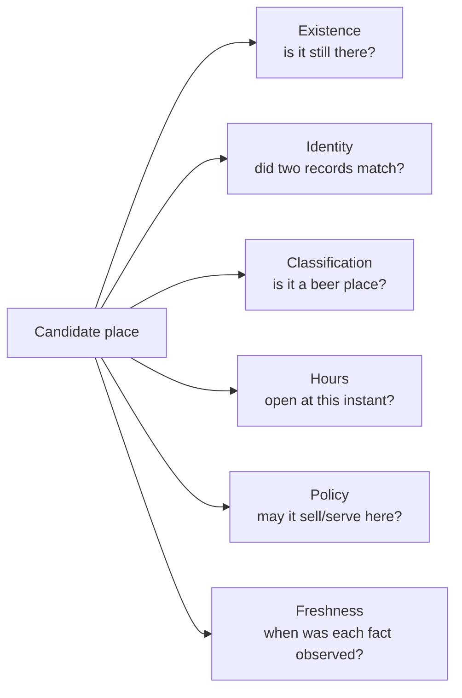

# 18 · Data-quality atlas

Status: empirical map of how cervezadonde.es knows, guesses and can be wrong.
Audited 2026-07-26 against the local serving database whose public `/api/meta`
snapshot matched production.

Update 2026-07-29: this document supplied the evidence for the precision-first
cleanup. The resulting policy and measured after-state are in
[`19-data-reliability-refinement.md`](./19-data-reliability-refinement.md).

This is not a promise to implement a particular cleanup plan. It is the shared
language, evidence and set of diagnostic lenses needed to decide well.

## 1. The central rule: truth is multidimensional

A place can be:

- correctly classified but permanently closed;
- real and open, but missing from OSM;
- present in two sources that refer to different businesses in the same
  building;
- real, but carrying an estimated schedule;
- open, but subject to a geographic rule the system has applied incorrectly.

One “confidence” number cannot represent all of that.



### Current representations

| Question | Field/mechanism | Limitation |
|---|---|---|
| Existence | API `verification` | Source-presence proxy, not a persisted evidence model |
| Identity | `oficial` badge after 30 m nearest-neighbour merge | No name/type/one-to-one constraint |
| Classification | score, level, type, beer flags | `confidence_level` also acts as visibility/deletion state |
| Hours | `hours_source` + parsed verdict | Defaults are guesses; website values do not expire cleanly |
| Policy | global Madrid rule | No geographic dispatch |
| Freshness | row last-seen + import time + cache file | Processing time can be newer than source data |

The current public names `verified`, `mapped` and `unverified` are retained
because they are the API contract. In analysis, prefer these more precise
phrases:

- `verified` → **OSM row spatially paired with at least one censo row**;
- `mapped` → **OSM-only row**;
- `unverified` → **non-OSM serving row**, usually censo-only.

## 2. Baseline measurements

### Serving inventory

| Metric | Count | Share of active |
|---|---:|---:|
| Active | 207,304 | 100% |
| OSM-backed | 169,701 | 81.9% |
| Censo/fixture-only | 37,603 | 18.1% |
| Real hours from OSM or websites | 29,586 | 14.3% |
| Empty name | 14,043 | 6.8% |
| Missing address | 94,408 | 45.5% |
| Marked chain | 23,485 | 11.3% |

Hours split:

| Source | Active rows |
|---|---:|
| OSM hours | 29,296 |
| Website hours | 290 |
| Either real source | 29,586 |
| No real hours | 177,718 |

The default schedule engine gives most of those 177,718 rows a likely-open or
likely-closed answer anyway. The UI labels it estimated, but this is why an
“open now” result is not equivalent to “confirmed current hours”.

### Types

| Type | Active | Empty name | Real-hour notes |
|---|---:|---:|---|
| bar | 154,270 | 8,900 | 15,621 OSM + 242 web |
| supermercado | 23,324 | 764 | 5,108 OSM + 18 web |
| alimentacion | 21,472 | 4,282 | 1,385 OSM + 27 web |
| gasolinera | 7,002 | 42 | 6,989 OSM; high due to ingest selection |
| bodega | 1,015 | 36 | 64 OSM + 3 web |
| tienda_24h | 217 | 19 | 129 OSM |
| otro | 4 | 0 | none |

Fuel-station coverage should not be compared directly with other types:
`amenity=fuel` without a recognized shop normally needs `opening_hours` merely
to enter the dataset, producing strong selection bias.

### Development fixture in serving data

`madrid_sample_fixture` contributes 27 active rows and 5 excluded rows to the
same table dumped to production. The API has no source exclusion, so fixture
rows are part of public results. Even if the fixture uses plausible real
places, production and test data are not currently separated.

## 3. Identity-merge audit

The national OSM merge currently pairs each active OSM store with the nearest
censo row within 30 m. The audit reconstructed that exact relation.

| Measure | Value |
|---|---:|
| Active OSM rows with a censo neighbour within 30 m | 29,800 |
| Distinct censo rows selected by those OSM rows | 22,789 |
| Extra OSM→same-censo assignments | 7,011 |
| Censo rows used by more than one OSM row | 5,350 |
| Maximum OSM rows paired to one censo row | 10 |
| OSM/censo place-type mismatches | 5,458 (18.3%) |
| Exact non-empty normalized-name matches | 5,175 (17.4%) |
| Mean match distance | 9.6 m |
| 95th percentile match distance | 26.1 m |

These numbers do not prove 7,011 wrong matches. A premises/licence record can
cover several counters or concepts, addresses can share centroids, and source
taxonomies differ. They do prove that `oficial` is not a one-to-one,
independent confirmation under the current algorithm.

Largest type-mismatch directions:

| OSM type | Chosen censo type | Count |
|---|---|---:|
| bar | alimentacion | 1,522 |
| bar | supermercado | 983 |
| alimentacion | bar | 812 |
| alimentacion | supermercado | 597 |
| supermercado | alimentacion | 469 |
| supermercado | bar | 433 |

Some mismatches are legitimate mixed-use venues or taxonomy differences.
Others are likely nearest-neighbour errors in dense streets and commercial
centres. The algorithm has no evidence to tell the two cases apart.

### Residual overlap

8,704 active censo-only rows have at least one active OSM store within 30 m but
remain visible. This is a **candidate-overlap count**, not a duplicate count:
there can be multiple real businesses in that radius. It identifies the size of
the area requiring entity-resolution evidence.

Exact-coordinate lenses found:

- 1,716 coordinate groups with multiple active rows;
- 2,877 extra rows within those groups;
- 98 groups / 302 extra rows when normalized name and coordinate are both
  identical.

Exact same-name/same-point rows are the strongest cheap duplicate candidates.
Even there, source history should be inspected before exclusion.

### Sticky official evidence

The OSM upsert does not clear `oficial`, and the merge only appends it. One
active `oficial` OSM row in the audited snapshot no longer had any censo row
within 30 m. Small today, but it demonstrates that the badge has no expiry or
negative-evidence path.

## 4. Empty-name audit

14,043 active OSM rows have an empty display name:

- 12,096 are `mapped`;
- 1,947 carry the `verified` label;
- 13,773 are medium classification confidence;
- 270 are high because they have hours.

Every one of the roughly 1,952 currently matched empty-name OSM rows had a
non-empty nearby censo name available in the reconstructed merge. The current
merge copies address/district/status but never the censo name, so the web can
render an empty `<h2>` and an unnamed nearest card.

Copying the nearest censo name blindly would make the identity problem worse.
A name fallback is useful only after a stronger match or with explicit
provenance such as “name supplied by censo candidate”.

## 5. How a non-existent or wrong place reaches the map

### Path A · Censo lag

1. A business closes.
2. Its licence remains marked active in the official directory.
3. The adapter ingests it as a high/medium beer candidate.
4. It has no OSM counterpart, so it remains `unverified`.
5. Default hours can mark it “suele estar abierto”.
6. It can become the nearest fallback if no OSM-backed open candidate is found.

Current mitigation: hollow marker, caution copy, OSM-backed trust tier first.
Missing evidence: a user/owner/current-web/other-source closure signal.

### Path B · OSM staleness

1. A mapped business closes but remains normally tagged in OSM.
2. The national PBF continues to include it.
3. Weekly ingest refreshes `last_seen_osm_at`, which means “still in OSM”, not
   “physically observed this week”.
4. The place remains `mapped` or `verified`.

Current mitigation: if the object disappears or is retagged out of scope, a
whole-Spain ingest prunes it, subject to the 15% safety valve.
Missing evidence: age/version of the underlying OSM feature and recency of a
human edit/confirmation.

### Path C · Proximity-only false corroboration

1. OSM business A and censo business B lie within 30 m.
2. B is the nearest censo row even if name/type differ.
3. A receives `oficial`; B is hidden.
4. A ranks in the strongest-looking tier.
5. Other nearby censo rows may remain visible, creating overlap.

Current mitigation: deterministic nearest choice and visual distinction only
for censo-only rows.
Missing evidence: entity-resolution score, one-to-one assignment, stored match
record, rejection/expiry.

### Path D · Stale censo cache presented as fresh processing

1. A censo file is downloaded once.
2. Weekly orchestration runs the adapter without `--fresh`.
3. The adapter reprocesses the cached bytes and updates every row's last-seen
   timestamp/import run.
4. `/meta` sees new processing timestamps even though the source snapshot did
   not change.

Current mitigation: file hash exists in local `import_runs`.
Missing evidence in production/API: source edition, source file timestamp,
cache-hit state, and per-source freshness.

### Path E · Estimated hours interpreted too strongly

1. A real place has no OSM or website hours.
2. `DEFAULT_HOURS_BY_TYPE` supplies a type-wide schedule.
3. `open_now.sells_beer_now` becomes true when that schedule says open.
4. `open_now=true` includes it in the flagship nearest result.

Current mitigation: `hours_source='estimated'`, “suele estar abierto” copy and
a distinct marker ring.
Remaining product question: whether “La más cercana abierta” is the right
eyebrow for an estimate.

### Path F · Correct record, wrong geographic rule

1. A takeaway shop is outside Madrid.
2. The API evaluates it using `Europe/Madrid` and Madrid's 22:00–09:00 rule.
3. It may be excluded from open-now results even when local rules/time would
   allow sale, or allowed when a different local rule would not.

This is not source-data quality, but it produces the same user outcome:
cervezadonde gives the wrong answer about a real place.

## 6. Source truth profiles

| Source | Strength | Structural bias | What “last seen” means |
|---|---|---|---|
| OSM | national, uniform, hours, community cleanup | incomplete; stale edits; unnamed POIs; tag noise | object still matched the latest extract |
| Madrid censo | detailed activity/status/address | licence lifecycle lags reality; cached file may be old | adapter reprocessed the row |
| Barcelona city | clean activity codes, names/address | 2024 edition, licence/premises lag | adapter reprocessed edition-pinned file |
| DIBA | broad daily directory, municipal reach | free-text classifier; missing/rough names | adapter reprocessed cached CSV |
| Andalucía IECA | huge regional coverage, CNAE | legal name instead of trading name; 2024 edition | adapter reprocessed edition-pinned WFS response |
| Business website | first-party hours when present | link rot, low structured-data adoption, stale pages | crawler checked the tagged URL |
| Default schedule | complete UX fallback | population-level guess, not observation | code version, not a date |
| Fixture | deterministic development | not production evidence | fixture ingest time |

## 7. Classification caveats

### OSM

OSM classification is a direct mapping, not `v2-beer`:

- all `bar|pub|cafe|restaurant|fast_food` become `bar` and on-site beer;
- target shops become takeaway;
- no name heuristic prevents an OSM bakery tagged `cafe` from becoming `bar`;
- hours decide high (80) versus medium (55), not whether it really sells beer;
- brand tags mark chains; the editable `chain_patterns` table is not used for
  OSM.

### Censos

- Madrid uses the richest scorer: epigraph, status, name hints and chain
  patterns.
- Barcelona and Andalucía use direct code lookup.
- DIBA uses conservative free-text Catalan tokens.
- every non-bar censo type is assumed to sell takeaway beer;
- every bar/restaurant-like censo type is assumed to serve beer.

The classifiers answer “likely useful beer category,” not “beer stock verified
at this business”.

### `confidence_level` overload

The same enum means:

- classification score bucket;
- visibility state (`excluded`);
- stale/pruned/duplicate suppression;
- in OSM, mostly “has real hours” versus “does not”.

That makes aggregate confidence charts hard to interpret. An excluded row may
be closed, vanished from OSM, a matched duplicate, a fixture exclusion, or a
scoring rejection.

## 8. Hours-quality caveats

### Precedence and persistence

OSM hours override website hours. If OSM hours disappear on the next PBF, the
OSM upsert writes null and website hours can take over.

Website hours behave differently:

- crawl failures/no-hours update `hours_web_checked_at`;
- `opening_hours_web = COALESCE(new_hours, old_hours)`;
- therefore a previously found schedule is never cleared when the site removes
  it or later becomes unreachable.

There is no `hours_observed_at`, source URL in the API response, conflict
record, or per-value expiry.

### Parser context

The `opening_hours` library is retried with Spain/Madrid context for public and
school holiday selectors. This avoids false “closed” for some PH/SH strings but
is still wrong for municipality/autonomous-community holiday calendars and
solar rules outside Madrid.

### `closes_at`

`getNextChange()` is reported as closing time whenever a place is currently
open. For unusual rules the next change can be a semantic state change that is
not a simple final close, so UI wording should remain conservative.

## 9. Pipeline safety caveats

### Partial Madrid ingest

`ingest:madrid --limit N` limits the candidates and then runs the normal
soft-deactivation step. On a populated database, every Madrid row outside the
limited sample is treated as missing and excluded. Older runbook copy called
this a harmless sanity run; it is not.

### Source failure after staging

Madrid truncates its staging table before parsing, but serving rows are only
updated as candidates succeed. The ingest is not wrapped in one database
transaction. A failure mid-upsert can leave a partially refreshed source and a
failed `import_run`; soft-deactivation is reached only after the loop.

Other censo adapters also batch-upsert without a whole-run transaction.

### Snapshot publication

Production truncates serving tables before restore, outside an explicit
transaction. There is no pre-publish validation manifest, row-count threshold,
checksum comparison, staging table or rollback to the previous snapshot.

### OSM prune threshold

The 15% guard is a useful catastrophic-safety check, not data validation. A
plausible-looking but systematically incomplete extract under that threshold
can still hide valid rows.

## 10. Read-only audit queries

These queries are intended as lenses. Counts are not pass/fail thresholds until
the product establishes expected ranges.

### Serving snapshot

```sql
SELECT
  count(*) AS physical,
  count(*) FILTER (WHERE confidence_level <> 'excluded') AS active,
  count(*) FILTER (WHERE confidence_level = 'excluded') AS excluded,
  count(*) FILTER (
    WHERE confidence_level <> 'excluded'
      AND (opening_hours_osm IS NOT NULL OR opening_hours_web IS NOT NULL)
  ) AS real_hours
FROM stores;
```

### Existence proxy

```sql
SELECT
  CASE
    WHEN source_name = 'osm' AND 'oficial' = ANY(badges) THEN 'verified'
    WHEN source_name = 'osm' THEN 'mapped'
    ELSE 'unverified'
  END AS verification,
  count(*)
FROM stores
WHERE confidence_level <> 'excluded'
GROUP BY 1
ORDER BY 1;
```

### Missing display essentials

```sql
SELECT
  source_name,
  count(*) FILTER (WHERE confidence_level <> 'excluded') AS active,
  count(*) FILTER (
    WHERE confidence_level <> 'excluded'
      AND nullif(btrim(name), '') IS NULL
  ) AS blank_name,
  count(*) FILTER (
    WHERE confidence_level <> 'excluded' AND address IS NULL
  ) AS no_address
FROM stores
GROUP BY 1
ORDER BY 1;
```

### Reconstruct merge fan-out

```sql
WITH nearest AS (
  SELECT o.id AS osm_id, c.id AS censo_id
  FROM stores o
  CROSS JOIN LATERAL (
    SELECT c.id
    FROM stores c
    WHERE c.source_name LIKE 'censo_%'
      AND ST_DWithin(c.geom::geography, o.geom::geography, 30)
    ORDER BY c.geom::geography <-> o.geom::geography, c.id
    LIMIT 1
  ) c
  WHERE o.source_name = 'osm'
    AND o.confidence_level <> 'excluded'
),
fanout AS (
  SELECT censo_id, count(*) AS n
  FROM nearest
  GROUP BY censo_id
)
SELECT
  count(*) FILTER (WHERE n = 1) AS used_once,
  count(*) FILTER (WHERE n >= 2) AS used_multiple,
  max(n) AS max_osm_per_censo
FROM fanout;
```

### Type mismatch matrix

```sql
SELECT
  o.place_type AS osm_type,
  c.place_type AS censo_type,
  count(*)
FROM stores o
CROSS JOIN LATERAL (
  SELECT c.place_type
  FROM stores c
  WHERE c.source_name LIKE 'censo_%'
    AND ST_DWithin(c.geom::geography, o.geom::geography, 30)
  ORDER BY c.geom::geography <-> o.geom::geography, c.id
  LIMIT 1
) c
WHERE o.source_name = 'osm'
  AND o.confidence_level <> 'excluded'
  AND o.place_type IS DISTINCT FROM c.place_type
GROUP BY 1, 2
ORDER BY 3 DESC;
```

### Active censo rows near OSM

```sql
SELECT count(*) AS overlap_candidates
FROM stores c
WHERE c.source_name LIKE 'censo_%'
  AND c.confidence_level <> 'excluded'
  AND EXISTS (
    SELECT 1
    FROM stores o
    WHERE o.source_name = 'osm'
      AND o.confidence_level <> 'excluded'
      AND ST_DWithin(o.geom::geography, c.geom::geography, 30)
  );
```

### Exact duplicate candidates

```sql
SELECT normalized_name, ST_AsText(geom), count(*), array_agg(id)
FROM stores
WHERE confidence_level <> 'excluded'
  AND normalized_name <> ''
GROUP BY normalized_name, geom
HAVING count(*) > 1
ORDER BY count(*) DESC;
```

### Processing freshness versus file identity

```sql
SELECT
  id, source_name, status, file_hash, row_count,
  started_at, finished_at
FROM import_runs
ORDER BY id DESC
LIMIT 30;
```

Repeated newer runs with the same hash mean reprocessing, not newer source
data. Production does not receive `import_runs`, so this check is local-only.

## 11. Evidence that would improve decisions

These are candidate measurements, not approved features:

- store the OSM element version/timestamp and ask how closure error varies with
  last edit age;
- label a stratified sample of proximity matches by distance/name/type/area;
- estimate precision/recall of a one-to-one matcher before changing serving
  rows;
- compare user-reported closures across `mapped`, spatially paired and
  censo-only tiers;
- measure walking-abandonment or immediate backtracking without collecting
  unnecessary personal data;
- record source-edition dates independently of processing timestamps;
- measure how often the nearest card is estimated versus real-hours;
- audit Canary and non-Madrid answers at policy boundaries;
- separate fixture rows and see whether any public traffic selected them.

## 12. Candidate quality gates for a future snapshot

These are a design menu, not active CI:

1. all expected sources have a successful current import;
2. source hashes/editions satisfy an explicit freshness policy;
3. active counts and type distributions stay inside reviewed drift bounds;
4. blank-name, exact-duplicate and overlap counts are reported;
5. OSM prune fraction and censo deactivation fraction are reviewed;
6. merge fan-out/type-mismatch distributions are compared with the prior
   snapshot;
7. no fixture source is present in production;
8. a fixed geographic/time probe suite returns expected policy and timezone
   outcomes;
9. restore into a staging database succeeds with constraints enabled;
10. publication swaps atomically and retains the previous snapshot.

The point of a quality gate is not to make the data look perfect. It is to stop
unknown or unexplained change from silently becoming a walking instruction.

## 13. Glossary

| Term | Precise use |
|---|---|
| active | API-visible by `confidence_level <> 'excluded'` |
| excluded | hidden row; reason is not normalized into one field |
| canonical OSM | national base source, not proof of physical existence today |
| censo-only | official row not hidden by the current merge |
| real hours | OSM or business-website schedule, as opposed to default estimate |
| verified | current API enum; OSM row with sticky `oficial` badge |
| mapped | OSM row without `oficial` |
| unverified | any non-OSM active row under current expression |
| match | current nearest censo candidate within 30 m |
| duplicate candidate | records similar enough to investigate, not auto-delete |
| freshness | date of the underlying evidence, distinct from processing time |
